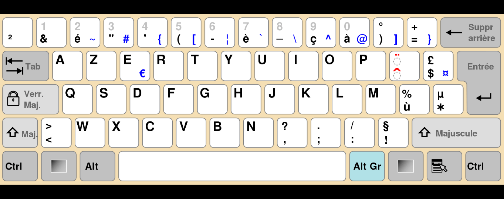

<!DOCTYPE html>
<html  >
<head>
  
  <meta charset="UTF-8">
  <meta http-equiv="X-UA-Compatible" content="IE=edge">
  <meta name="generator" content="Mobirise v5.2.0, mobirise.com">
  <meta name="viewport" content="width=device-width, initial-scale=1, minimum-scale=1">
 
  <meta name="description" content="">
  
  
  <title>Home</title>
  <link rel="stylesheet" href="assets/bootstrap/css/bootstrap.min.css">
  <link rel="stylesheet" href="assets/bootstrap/css/bootstrap-grid.min.css">
  <link rel="stylesheet" href="assets/bootstrap/css/bootstrap-reboot.min.css">
  <link rel="stylesheet" href="assets/theme/css/style.css">
<link rel="stylesheet" href="assets/mobirise/css/mbr-additional.css" type="text/css">
  <link rel="icon" href="#" sizes="16x16" type="image/png">
  
  
  
</head>
<body style="background-color:#47b5ed">
  
  <section class="header10 cid-sdRZpmfNFA" id="header10-0">

   
    

        

            

                <h1 class="mbr-section-title mbr-fonts-style mb-3 display-1">AZTERY</h1>
                
I lost ctrl and I need a new keyboard. Will you be my typing assistant?&nbsp; $goqTzteo=)depaxzazy)Y 

                
                

                    
                

            

        

    

</section>

  
</body>
</html>
